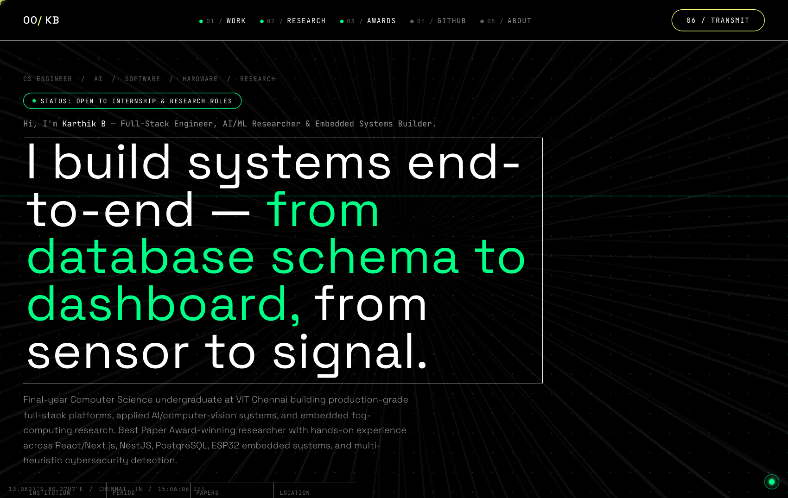
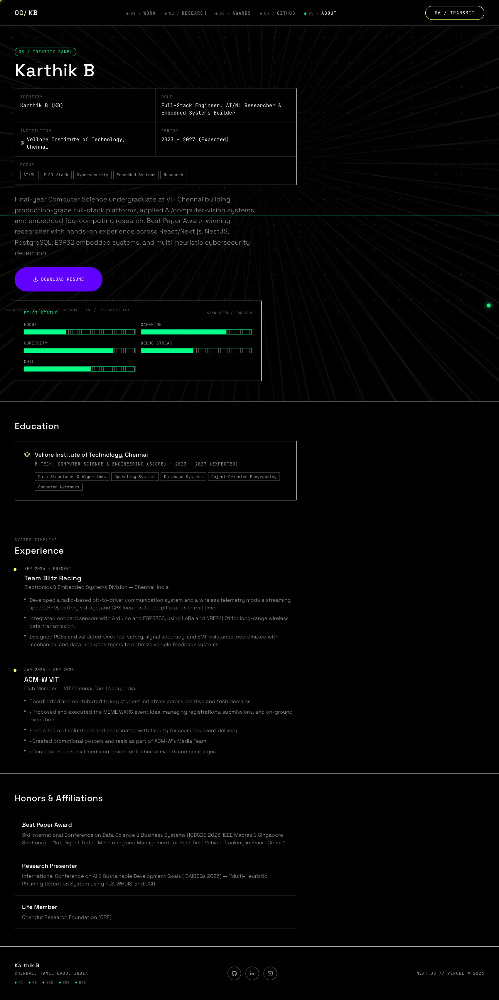
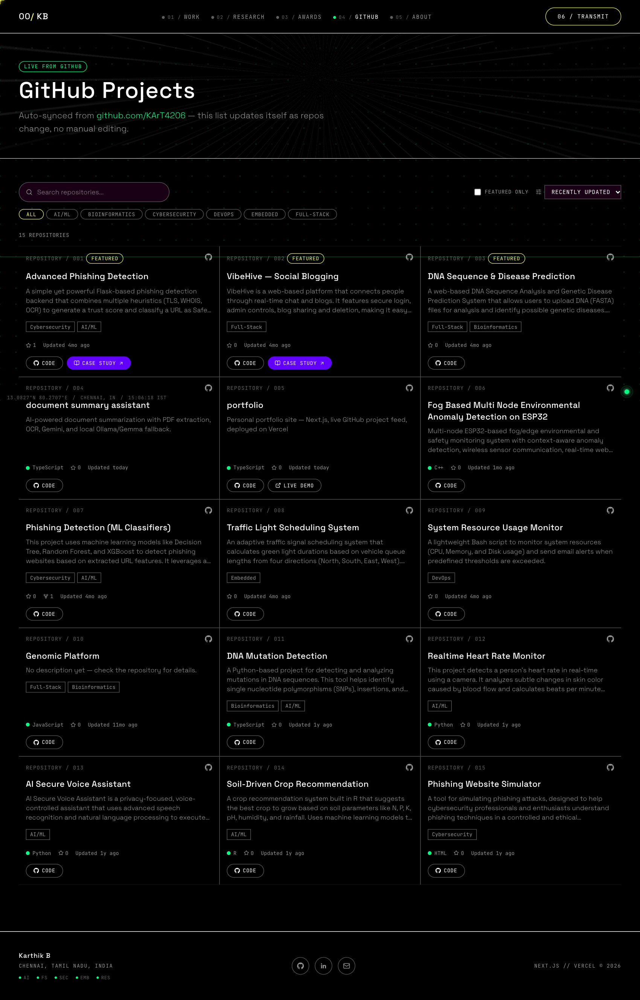
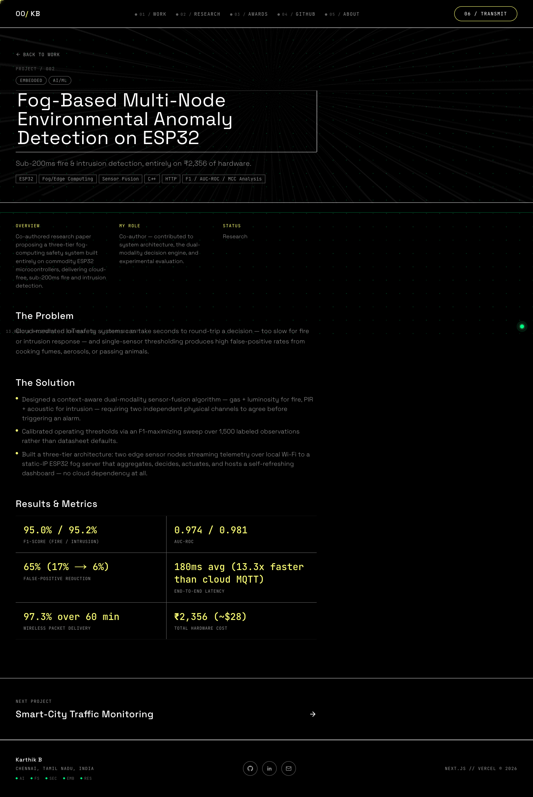
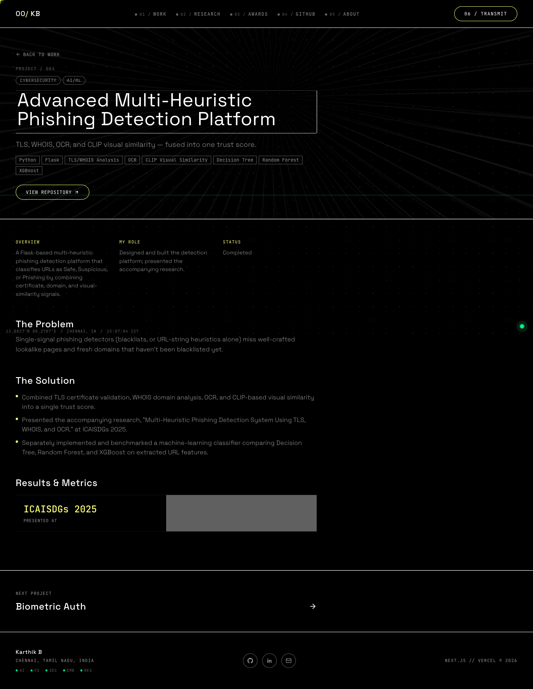

# Karthik B – Portfolio

A personal portfolio that doubles as a small content-management system. The public site presents projects, published research, awards, experience and skills in a "cockpit HUD" visual style, with a **live GitHub project feed**; a private **admin CMS** edits all of it without redeploying.

**Live site:** https://portfolio-kart4206s-projects.vercel.app

> This repository documents the project (description, design, screenshots). The source code lives in a private repository, `portfolio-code`.

## Screenshots

**Home**: hero, live status bars, selected work, research, awards, skill stack and contact form.



| About (identity panel, education, experience, honours) | GitHub feed |
|---|---|
|  |  |

| Project case study | Project case study |
|---|---|
|  |  |

## Features
- **Case-study pages** for each project: summary, status, stack, role and links, generated from CMS data.
- **Research and awards sections**, including publication metrics and recognition such as Best Paper Award.
- **Live GitHub feed**: the site reads the owner's public repositories through the GitHub API, caches them for an hour (ISR), and a GitHub webhook revalidates the cache instantly on push. Each repository card can be given a custom title, summary and visibility in the admin.
- **Contact form** that stores messages in the database and, when an e-mail key is configured, sends a notification.
- **Admin CMS** (password-protected): create, edit and soft-delete projects, research, publications, awards, certifications, experience, education and skill groups; upload media and a downloadable resume; manage the profile and site settings; read messages; and review an **audit log** of every change.
- **Optional fun layer** toggled from the admin: mascots, a small arcade (Snake, Neon Maze, XOX, Catch the Ghost), a CMS-backed terminal and a secret keyboard mode.
- **Dark HUD design system** with scroll-reveal animation, responsive down to phones.

## How it works
```
Visitor -> Next.js (App Router, server components) -> Prisma -> PostgreSQL
                         |-> GitHub REST API (hourly cache + webhook revalidation)
Admin  -> /admin (signed session cookie) -> server actions -> validate (zod) -> Prisma -> audit log
Uploads -> local disk in dev / Vercel Blob in production
Contact -> /api/contact -> DB row + e-mail (Resend)
```
1. **Content lives in PostgreSQL** (projects, research, awards, experience, education, skills, media, profile, site settings, messages, audit log). Pages are server-rendered from it, so edits appear without a rebuild.
2. **Resilience**: if the database is unreachable, public queries fall back to empty sections instead of crashing the site.
3. **Admin security**: Argon2 password hashes, HMAC-SHA256 signed session cookies (rotating the secret logs everyone out), login-attempt tracking, forced password change, and every mutation protected by a server-side admin check.
4. **GitHub integration**: repositories are fetched server-side with an optional token, cached, and merged with admin-defined presentation overrides.
5. **Deployment**: Vercel; the build runs migrations and seed scripts so a fresh database is created and populated automatically.

## Tech stack
Next.js 16, React 19, TypeScript, Tailwind CSS 4, Framer Motion, Prisma 7, PostgreSQL, Argon2, Zod, Resend, Vercel Blob, Vercel.

## Author
Karthik B, final-year Computer Science undergraduate, VIT Chennai.
